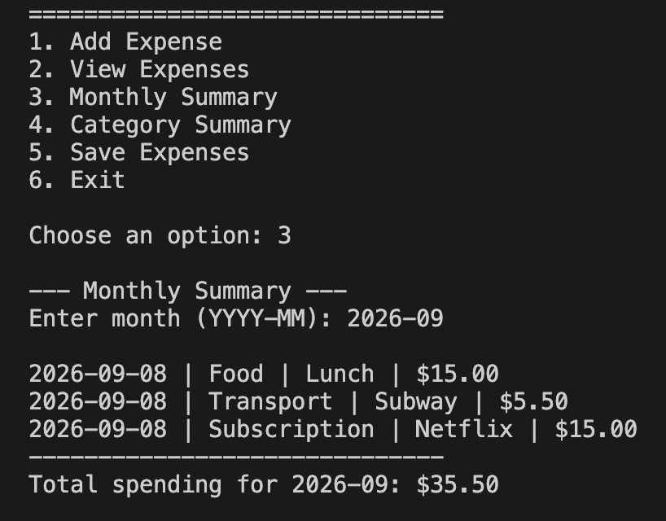
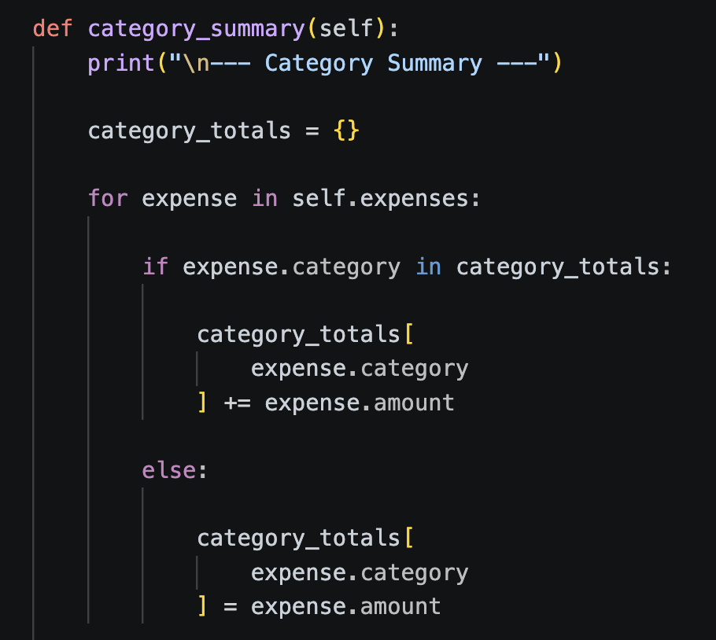

# Personal Expense Tracker

A Python-based personal expense tracking application developed during
my first semester of Information Technology at UTS College.

## Overview

The Personal Expense Tracker is a console-based Python application
designed to record, organise and analyse personal spending.

Users can:

- Add a new expense
- View all expenses
- Generate a monthly summary
- Generate a category summary
- Save expense data to CSV
- Reload saved expense data

The project was developed to apply Python programming concepts
to a practical data-management application.

---

## Features

- Add expenses with:
  - Date
  - Category
  - Description
  - Amount
- Automatically use today's date when no date is entered
- Display all stored expenses
- Calculate total monthly spending
- Calculate category-based spending totals
- Save expenses to a CSV file
- Load existing expenses when the application starts
- Handle invalid amount input using exception handling

---

## Technologies & Concepts

- Python
- Object-Oriented Programming
- Classes and Objects
- Lists
- Dictionaries
- CSV
- File Handling
- Loops
- Methods
- Exception Handling
- User Input
- `datetime`
- `pathlib`

---

## Program Structure

### Expense

Represents a single expense record.

Each expense contains:

- Date
- Category
- Description
- Amount

### ExpenseTracker

Controls the main application and manages all expense records.

Important methods include:

- `add_expense()`
- `view_expenses()`
- `monthly_summary()`
- `category_summary()`
- `save_expenses()`
- `load_expenses()`
- `run()`

---

## Category Summary Example

The following Python code uses a dictionary to calculate
the total spending for each category.

```python
category_totals = {}

for expense in self.expenses:

    if expense.category in category_totals:
        category_totals[expense.category] += expense.amount

    else:
        category_totals[expense.category] = expense.amount
```

This allows the application to dynamically group expenses
without requiring predefined categories.

---

## CSV File Handling

Expense data is stored using Python's `csv` module.

```python
with open(
    self.filename,
    "w",
    newline="",
    encoding="utf-8"
) as file:

    writer = csv.writer(file)

    writer.writerow(
        [
            "Date",
            "Category",
            "Description",
            "Amount"
        ]
    )

    for expense in self.expenses:

        writer.writerow(
            [
                expense.date,
                expense.category,
                expense.description,
                expense.amount
            ]
        )
```

The application also loads previously saved CSV data
when the program starts.

---

## Program Output

The following screenshot shows the Monthly Summary feature
running in VS Code.

The application filters expenses by month and calculates
the total spending for the selected month.



---

## Python Code Example

The following screenshot shows the `category_summary()` method.

This method uses a dictionary, loop and conditional statement
to calculate category-based spending totals.



---

## Example CSV Data

The application stores expense information using the following structure:

```csv
Date,Category,Description,Amount
2026-09-08,Food,Lunch,15.0
2026-09-08,Transport,Subway,5.5
2026-09-08,Subscription,Netflix,15.0
```

---

## What I Learned

This project improved my understanding of Python data structures,
object-oriented programming and file handling.

I gained practical experience with:

- Lists
- Dictionaries
- CSV files
- File handling
- Object-oriented programming
- Classes and objects
- Loops
- Exception handling
- User input
- Data aggregation
- Debugging

I also learned how Python can be used to build a practical
data-processing application that stores, retrieves and analyses
information.

---

## Source Code

The complete Python application is available in:

[`expense_tracker.py`](expense_tracker.py)

Sample expense data is available in:

[`expenses.csv`](expenses.csv)

---

## Author

Joel Lee

UTS College  
Diploma of Information Technology
